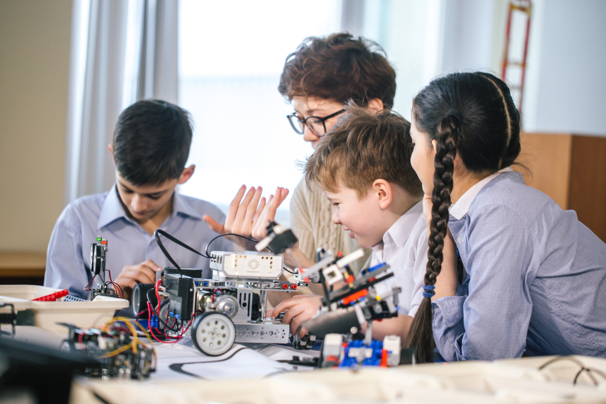

# Introducción

<figure><figcaption></figcaption></figure>

¡Bienvenidos!

En este curso taller, aprenderemos los principios básicos de la fabricación digital, qué es y para qué sirve, un poco de electrónica básica y programación, el arduino sus sensores y actuadores, sobre la fabricación aditiva y sustractiva, la impresión 3D y sus usos, las máquinas de contron númérico (CNC) y las cortadoras laser.

Este taller será en parte experiencial para que puedan probar ustedes mismos el uso de la tecnología, y por eso he creado esta guía con diferentes videos sobre los temas relacionados, contenidos, tutoriales, códigos, esquemas, ejemplos y referencias, para que la puedan consultar cuando desean repasar algo o indagar más a fondo.

Luego de aprender los conceptos básicos de la fabricación digital, haremos un taller de design thinking diseñado específicamente para profesores, para que cada uno pueda con el replantearse la forma en la que puede enseñar los conocimientos de su asignatura en el aula aplicando lo aprendido, para llevar la experiencia de aprendizaje a otro nivel.

Al concluir el taller de design thinking, cada profesor tendrá una serie de ideas que podremos convertir en un nuevo taller que desarollemos para sus alumnos en el aula, con el soporte del instructor y el apoyo de las máquinas y espacio del Florida Lab.

Espero todo esto sea de su agrado y utilidad.

#### **Pablo Zuloaga Betancourt,** INSTRUCTOR POWAR STEAM
