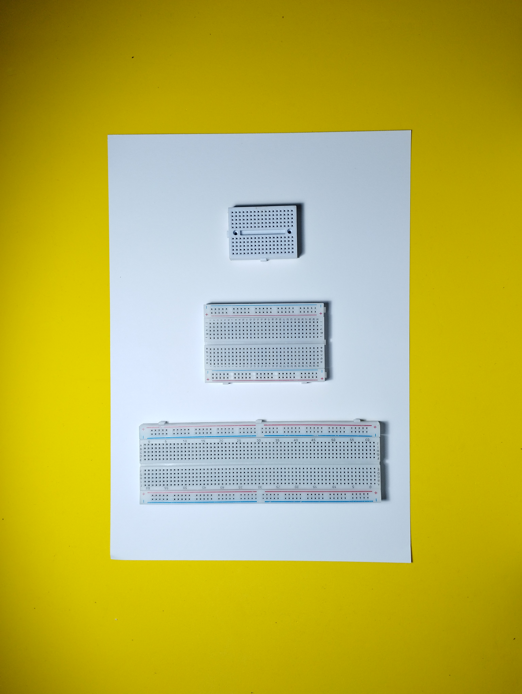

# Breadboard o Protoboard

Un breadboard (protoboard) es un dispositivo utilizado en electrónica para probar y construir circuitos temporales. Es una placa con una serie de agujeros conectados por conductores eléctricos internos, los cuales permiten conectar componentes eléctricos como resistencias, capacitores, transistores, etc. mediante los conectores enchufables.

<figure><figcaption></figcaption></figure>

La ventaja de los breadboards es que permiten conectar y desconectar fácilmente los componentes, lo que hace que sea fácil probar diferentes configuraciones de circuitos sin soldar los componentes. También son útiles para prototipar circuitos antes de construirlos de manera permanente en una placa de circuito impreso.

<figure><figcaption></figcaption></figure>

Los breadboards suelen tener una variedad de tamaños, y se clasifican por la cantidad de terminales de los componentes que pueden alojar. Los breadboards también tienen zonas divididas en dos, una para la alimentación y otra para la señal, de esta manera se facilita el trabajo y se evita errores.

<figure><figcaption></figcaption></figure>

Las líneas de + y – vienen conectadas horizontalmente, y las líneas numeradas vienen conectadas verticalmente.
