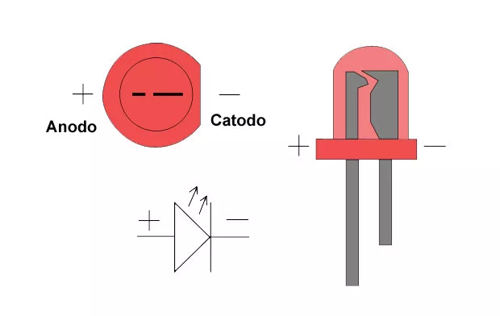
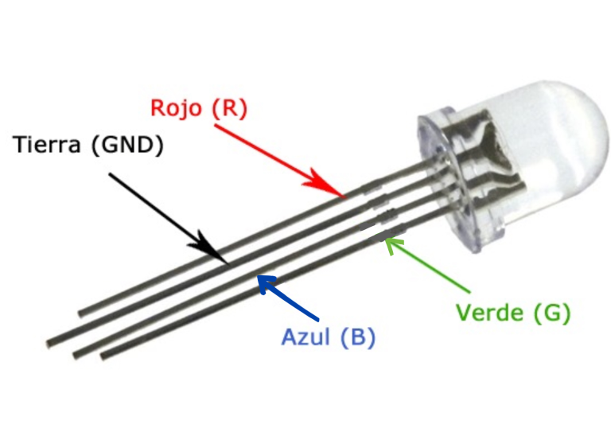
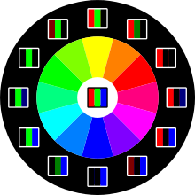

# LED

<figure><figcaption></figcaption></figure>

Un LED (diodo emisor de luz) es un componente electrónico que emite luz cuando se le aplica corriente eléctrica. Los LED son muy eficientes y duraderos, y se utilizan ampliamente en una gran variedad de dispositivos y aplicaciones, desde pantallas de visualización hasta iluminación.

Los LED tienen una estructura semiconductora similar a la de los transistores, y se fabrican a partir de materiales como el silicio o el galio. Al aplicarle corriente eléctrica, los electrones en el LED se mueven hacia el cátodo (terminal negativo), lo que produce la emisión de luz. Los LED emiten luz en una longitud de onda específica, dependiendo del material del que estén hechos. Por ejemplo, los LED de color rojo emiten luz roja, mientras que los LED de color verde emiten luz verde.

<figure><figcaption></figcaption></figure>

Los LED tienen varias ventajas sobre otros tipos de dispositivos de iluminación, como las bombillas incandescentes o fluorescentes. Son más eficientes, ya que consumen menos energía para producir la misma cantidad de luz. También son más duraderos, ya que pueden durar mucho más tiempo que otras fuentes de luz. Además, los LED no contienen elementos tóxicos como el mercurio, lo que los hace más respetuosos con el medio ambiente.

## LED RGB

<figure><figcaption></figcaption></figure>

Un LED RGB (diodo emisor de luz de colores) es un tipo de LED que puede emitir luz de diferentes colores. Los LED RGB funcionan de manera similar a los LED normales, pero utilizan una estructura semiconductora más compleja que incluye tres capas de material semiconductor diferentes, cada una de las cuales es responsable de emitir un color diferente: rojo, verde y azul. Al mezclar estos tres colores de luz de manera adecuada, se pueden crear una gran variedad de colores.

<figure><figcaption></figcaption></figure>

Para controlar el color de un LED RGB, se utilizan tres pines de control independientes, uno para cada color. Al aplicar diferentes niveles de corriente a cada pin, se pueden controlar la intensidad de cada color y, por lo tanto, el color final del LED. Por ejemplo, si se aplica corriente a los pines rojo y verde, pero no a azul, el LED emitirá luz amarilla.

<figure><figcaption></figcaption></figure>

Los LED RGB se utilizan ampliamente en aplicaciones de iluminación y señalización, ya que permiten crear una gran variedad de colores y efectos visuales. También se utilizan en dispositivos como pantallas de visualización, proyectores y televisores, donde se necesitan diferentes colores para crear imágenes y vídeos.

<figure><figcaption></figcaption></figure>
