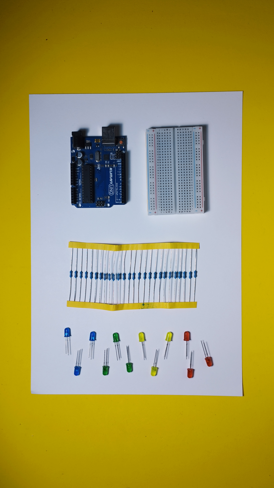

# Led Blink

Para conectar un LED al Arduino, necesitarás un LED, una resistencia y algunos cables de conexión. El esquema de conexión es el siguiente:

<figure><figcaption></figcaption></figure>

1. Conecta un extremo del cable de conexión al pin del LED correspondiente (anodo o cátodo, según el tipo de LED).
2. Conecta el otro extremo del cable de conexión a la resistencia.
3. Conecta un extremo de la resistencia al pin GND (tierra) del Arduino.
4. Conecta el otro extremo de la resistencia a un pin digital de salida del Arduino.

<figure><figcaption></figcaption></figure>

Aquí está un esquema de ejemplo de cómo conectar un LED al Arduino:

<figure><figcaption></figcaption></figure>

En este esquema, el LED está conectado al pin 13 del Arduino a través de una resistencia de 220 ohmios. La resistencia se utiliza para proteger el LED de recibir demasiada corriente, lo que podría dañarlo. Asegúrate de elegir una resistencia adecuada para el LED que estés utilizando, y de conectar el LED al pin correcto según su polaridad (anodo o cátodo).

## LED Blink - 1 LED:

Este código hace que el LED parpadee cada segundo. Si quieres cambiar la tasa de parpadeo, puedes modificar el tiempo de espera en la función `delay()`. Por ejemplo, para hacer que el LED parpadee más rápido, puedes reducir el tiempo de espera a 500 milisegundos (1/2 segundo).

```arduino
const int LED_PIN = 13;  // Pin del LED conectado al Arduino

void setup() {
  // Configurar el pin del LED como una salida
  pinMode(LED_PIN, OUTPUT);
}

void loop() {
  // Encender el LED
  digitalWrite(LED_PIN, HIGH);
  // Esperar 1 segundo
  delay(1000);
  // Apagar el LED
  digitalWrite(LED_PIN, LOW);
  // Esperar 1 segundo
  delay(1000);
}
```

## LED Blink - 2 LEDs:

Para hacer parpadear dos LED con Arduino, necesitarás dos LED, dos resistencias y algunos cables de conexión. El esquema de conexión es el siguiente:

<figure><figcaption></figcaption></figure>

1. Conecta un extremo de un cable de conexión al pin del primer LED correspondiente (anodo o cátodo, según el tipo de LED).
2. Conecta el otro extremo del cable de conexión a una resistencia.
3. Conecta un extremo de la resistencia al pin GND (tierra) del Arduino.
4. Conecta el otro extremo de la resistencia a un pin digital de salida del Arduino.
5. Repite los pasos 1 a 4 para el segundo LED, utilizando una segunda resistencia y un segundo pin de salida del Arduino.

Para agregar un segundo LED al código, primero debes conectar el LED al Arduino y asignarle un número de pin. Luego, puedes modificar el código de la siguiente manera:

```arduino
const int LED1_PIN = 13;  // Pin del primer LED
const int LED2_PIN = 12;  // Pin del segundo LED

void setup() {
  // Configurar los pines de los LED como salidas
  pinMode(LED1_PIN, OUTPUT);
  pinMode(LED2_PIN, OUTPUT);
}

void loop() {
  // Encender el primer LED
  digitalWrite(LED1_PIN, HIGH);
  // Apagar el segundo LED
  digitalWrite(LED2_PIN, LOW);
  // Esperar 1 segundo
  delay(1000);
  // Apagar el primer LED
  digitalWrite(LED1_PIN, LOW);
  // Encender el segundo LED
  digitalWrite(LED2_PIN, HIGH);
  // Esperar 1 segundo
  delay(1000);
}
```

Este código hace que los dos LED parpadeen alternativamente, con una tasa de parpadeo de 1 segundo. Puedes modificar el tiempo de espera en la función `delay()` para cambiar la tasa de parpadeo. También puedes cambiar el orden en que los LED se encienden y apagan, modificando el código del bucle `loop()`.

## LED Blink Semáforo:

<figure><figcaption></figcaption></figure>

## Esquema:

<figure><figcaption></figcaption></figure>

Aquí hay un código de Arduino para hacer que tres LED funcionen como un semáforo:

```arduino
const int RED_LED_PIN = 9;    // Pin del LED rojo
const int YELLOW_LED_PIN = 10;  // Pin del LED amarillo
const int GREEN_LED_PIN = 11;   // Pin del LED verde

void setup() {
  // Configurar los pines de los LED como salidas
  pinMode(RED_LED_PIN, OUTPUT);
  pinMode(YELLOW_LED_PIN, OUTPUT);
  pinMode(GREEN_LED_PIN, OUTPUT);
}

void loop() {
  // Encender el LED rojo y apagar los demás
  digitalWrite(RED_LED_PIN, HIGH);
  digitalWrite(YELLOW_LED_PIN, LOW);
  digitalWrite(GREEN_LED_PIN, LOW);
  delay(5000);  // Esperar 5 segundos

  // Encender el LED amarillo y apagar los demás
  digitalWrite(RED_LED_PIN, LOW);
  digitalWrite(YELLOW_LED_PIN, HIGH);
  digitalWrite(GREEN_LED_PIN, LOW);
  delay(1000);  // Esperar 1 segundo

  // Encender el LED verde y apagar los demás
  digitalWrite(RED_LED_PIN, LOW);
  digitalWrite(YELLOW_LED_PIN, LOW);
  digitalWrite(GREEN_LED_PIN, HIGH);
  delay(3000);  // Esperar 3 segundos

  // Encender el LED amarillo y apagar los demás
  digitalWrite(RED_LED_PIN, LOW);
  digitalWrite(YELLOW_LED_PIN, HIGH);
  digitalWrite(GREEN_LED_PIN, LOW);
  delay(1000);  // Esperar 1 segundo
}

```

Este código hace que los LED funcionen como un semáforo tradicional, con un ciclo de luz roja durante 5 segundos, luz amarilla durante 1 segundo, luz verde durante 3 segundos, y luz amarilla durante 1 segundo. Puedes modificar los tiempos de espera en las funciones `delay()` para cambiar la duración de cada fase del semáforo. También puedes agregar más fases al semáforo, como luz roja y verde al mismo tiempo para indicar que los vehículos pueden girar a la derecha en rojo, por ejemplo.
