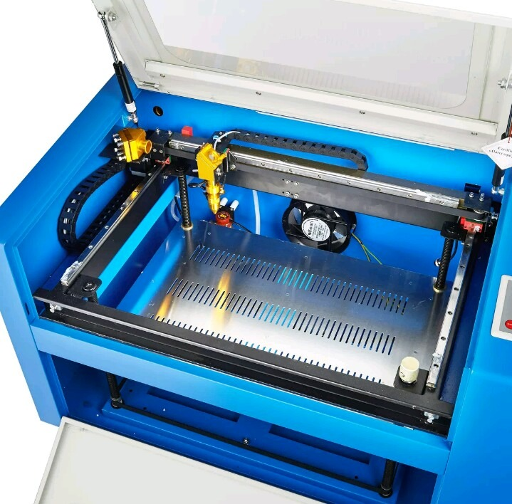

# Tipos de Máquinas CNC

Existen varios tipos de máquinas CNC que se utilizan en la industria y la fabricación de piezas y componentes, algunas de las más comunes incluyen:

<figure><figcaption></figcaption></figure>

* Tornos CNC: Estas máquinas se utilizan para cortar y dar forma a piezas cilíndricas y pueden realizar operaciones de torneado, perforación y roscado.

<figure><figcaption></figcaption></figure>

* Fresadoras CNC: Estas máquinas se utilizan para cortar y dar forma a piezas de forma plana o tridimensional y pueden realizar operaciones de fresado, taladrado y escariado.

<figure><figcaption></figcaption></figure>

* Máquinas de corte por láser CNC: Estas máquinas utilizan un láser para cortar y dar forma a materiales como el metal, la madera y el plástico.

<figure><figcaption></figcaption></figure>

* Máquinas de corte por chorro de agua CNC: Estas máquinas utilizan un chorro de agua a alta presión para cortar y dar forma a materiales duros y blandos.

<figure><figcaption></figcaption></figure>

* Máquinas de corte por plasma CNC: Estas máquinas utilizan un chorro de plasma para cortar y dar forma a materiales metálicos.

Además de estas máquinas, también existen otros tipos de máquinas CNC, como las máquinas de electroerosión, las máquinas de marcado láser y las máquinas de grabado CNC, entre otras. Cada tipo de máquina se utiliza para tareas específicas y tiene sus propias ventajas y desventajas en función de la aplicación.
