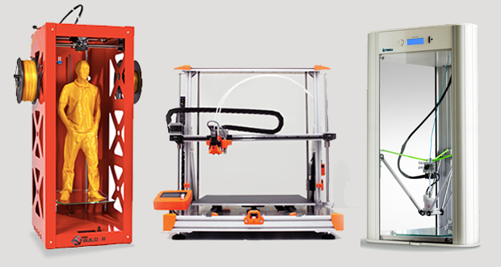
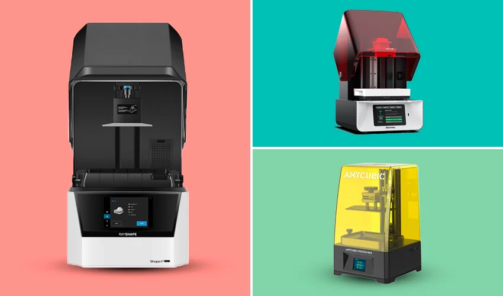
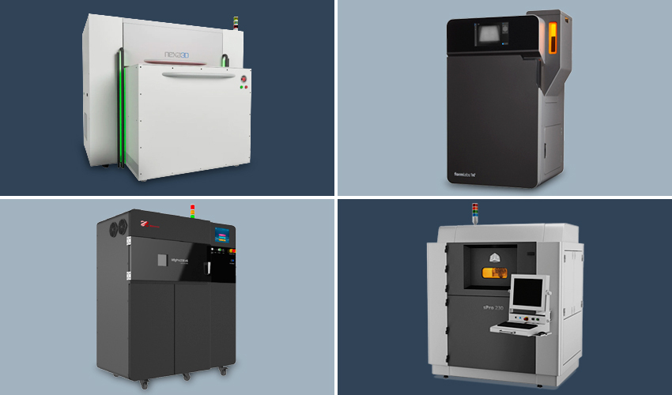
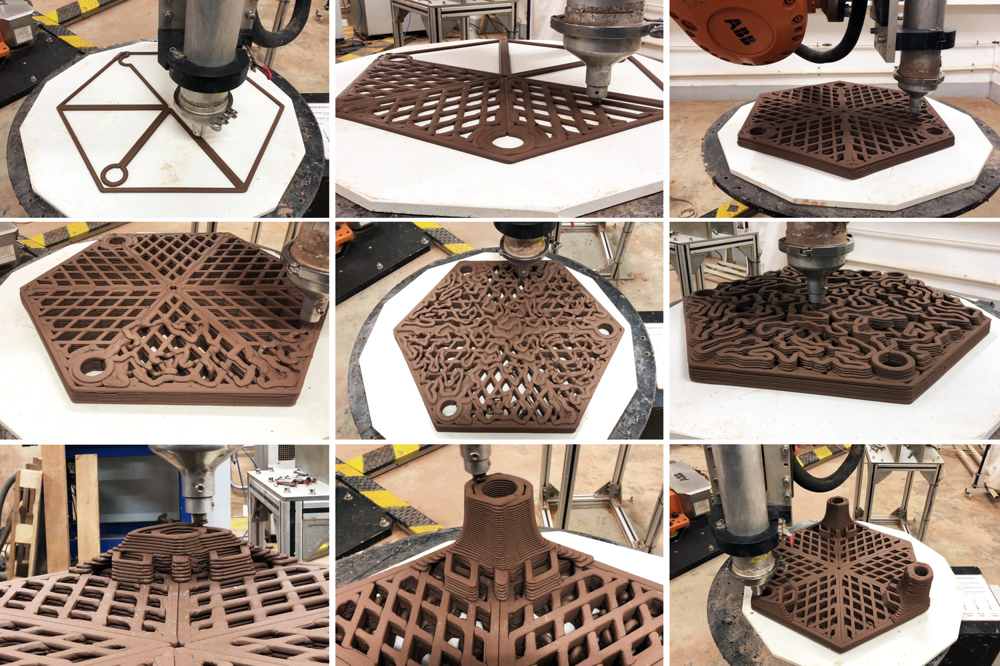
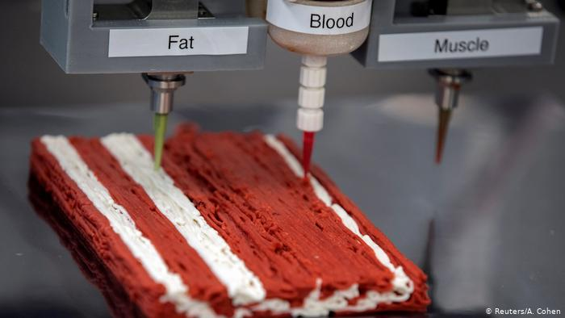

# Tecnologías de Fabricación Aditiva

La **fabricación aditiva** (AM, siglas en inglés de additive manufacturing) involucra cualquier proceso en el que las piezas se produzcan depositando material para crear las formas deseadas. Construyen objetos añadiendo material mediante superposición de capas sucesivas hasta que la pieza esté completa. **La impresión 3D**, es el proceso de fabricación aditiva más común y conocido en el mercado.

### **Impresoras 3D (FDM)**

<figure><figcaption>
<a href="https://www.3dnatives.com/es/top-10-impresoras-fdm-volumen-de-impresion-21092016/">https://www.3dnatives.com/es/top-10-impresoras-fdm-volumen-de-impresion-21092016/</a>
</figcaption></figure>

**La tecnología FDM o de modelado por deposición fundida** **(Filament Disposed Material)** son las que fabrican objetos al derretir y extrudir un filamento termoplástico para crear una forma determinada en un diseño. Estas pueden usar diferentes tipos de plástico con diferentes propiedades y colores.

### **Impresión 3D (SLA)**

<figure><figcaption>
<a href="https://www.3dnatives.com/es/mejores-impresoras-resina-19052016/">https://www.3dnatives.com/es/mejores-impresoras-resina-19052016/</a>
</figcaption></figure>

El proceso de la impresión por **Estereolitografía SLA (Stereolitography)** fue el primero que se planteo, y se basa, que se basa en la fotopolimerización de una resina sensible a los rayos UV utilizando un láser para convertirla en plástico endurecido. Estos lasers con como una especie de pantalla que va subiendo lentamente por el líquido y al proyectar una tajada de la imagen endurecen la resina.

### **Impresoras 3D (SLS)**

<figure><figcaption>
<a href="https://www.3dnatives.com/es/impresoras-3d-sls-220320182/#!">https://www.3dnatives.com/es/impresoras-3d-sls-220320182/#!</a>
</figcaption></figure>

Las impresoras de **Sinterizado Selectivo por Láser (SLS)** usan un láser de alta potencia para fundir pequeñas partículas de polvo de polímero que al solidificarse forman un objeto. Similar a la estereolitografía, a medida que el laser va subiendo proyecta una luz en ciertas capas del polvo lo cuál hace que se solidifique.

### Otras tecnologías:

<figure><figcaption>
<a href="https://www.archdaily.cl/cl/947525/restauracion-ecologica-de-arrecifes-mediante-la-impresion-de-arcilla-en-3d">https://www.archdaily.cl/cl/947525/restauracion-ecologica-de-arrecifes-mediante-la-impresion-de-arcilla-en-3d</a>
</figcaption></figure>

Todos los años surgen nuevas tecnologías de Impresión en 3D en diferentes tipos de materiales o evolucionando algunas de las tecnologías actuales. Algunas de las tecnologías modificadas que más se están usando son las de impresión con arcilla para la construcción de casas, vacijas o regeneración de arrecifes, también la impresión con alimentos como el chocolate, masa de galletas e incluso proteinas que simulan diferentes tipos de carnes (bioimpresión) o en diferentes tipos de biomateriales como la caceina u otros para crear productos cada vez más sostenibles.

Estas tecnologías modificadas por lo general usan un funcionamiento y características similares a las impresoras FDA en cuanto a que hacen disposición de material para crear nuevos objetos.

<figure><figcaption>
<a href="https://primeroeditores.com.mx/entretenimiento/carne-impresa-en-3d-100-comestible/">https://primeroeditores.com.mx/entretenimiento/carne-impresa-en-3d-100-comestible/</a>
</figcaption></figure>



### LINKS DE INTERÉS:





{% embed url="https://blog.laminasyaceros.com/blog/las-7-categor%C3%ADas-de-la-manufactura-aditiva" %}
