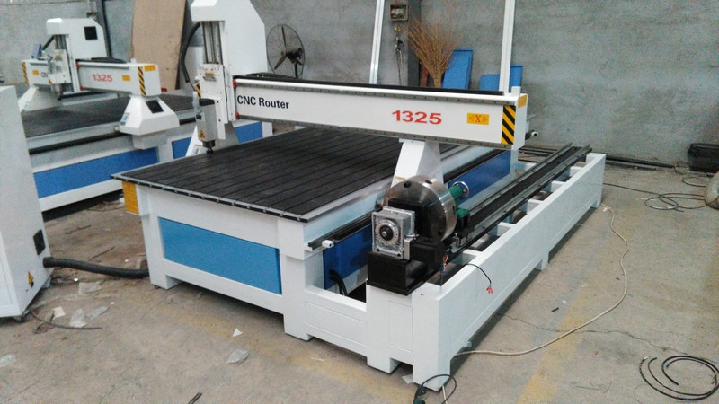

# Tecnologías de Fabricación Sustractiva

La **fabricación sustractiva** es cualquier proceso en el que las piezas se producen al eliminar el material de un bloque sólido, barras de plástico, metal u otros materiales eliminados mediante corte, perforación y esmerilado para producir la forma deseada. Estos procesos se realizan manualmente o, más comúnmente, con la ayuda de un control numérico computarizado (CNC).

* Tornos
* Sierras
* Fresadoras
* Cortadoras
* Taladros
* Corte por láser
* Corte de vinil
* Chorro de agua

<figure><figcaption></figcaption></figure>

<figure><figcaption></figcaption></figure>

### **Cortadoras láser usan un láser para cortar:**

<figure><figcaption>
<a href="https://www.troteclaser.com/es/maquinas-laser/grabadora-laser-speedy">https://www.troteclaser.com/es/maquinas-laser/grabadora-laser-speedy</a>
</figcaption></figure>

Son herramientas rentables, rápidas y fáciles de usar para grabar o cortar materiales finos en láminas planas. Estas pueden cortar materiales como acrílico, cuero, madera, cartón hasta incluso metal.

### **Cortadoras por chorro de agua**

<figure><figcaption></figcaption></figure>

Usan agua mezclada con abrasivos y presión alta para cortar a través de casi cualquier material. Muchas veces como aditivo se usa un tipo de arena para lograr estos cortes con la presión del agua.

### **Cortadora CNC de madera:**

<figure><figcaption>
<a href="https://spanish.industriallasercuttingmachine.com/">https://spanish.industriallasercuttingmachine.com/</a>
</figcaption></figure>

Es uno de los tipos de CNC (Computer Numeric Controlled) que existen, ya que la mayoría de las máquinas de fabricación digital son máquinas de Control Numérico Computarizado que sirve para crotar madera, plásticos o metales.
