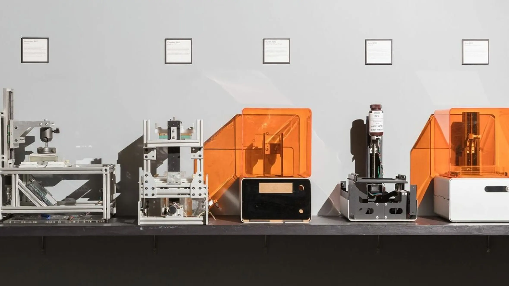
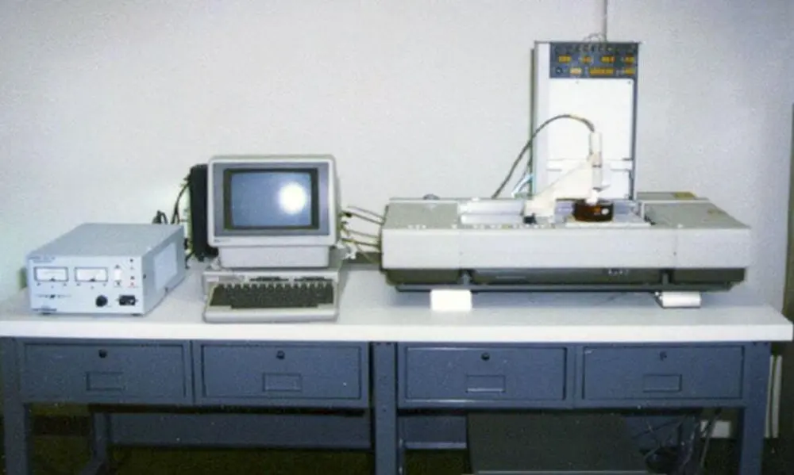
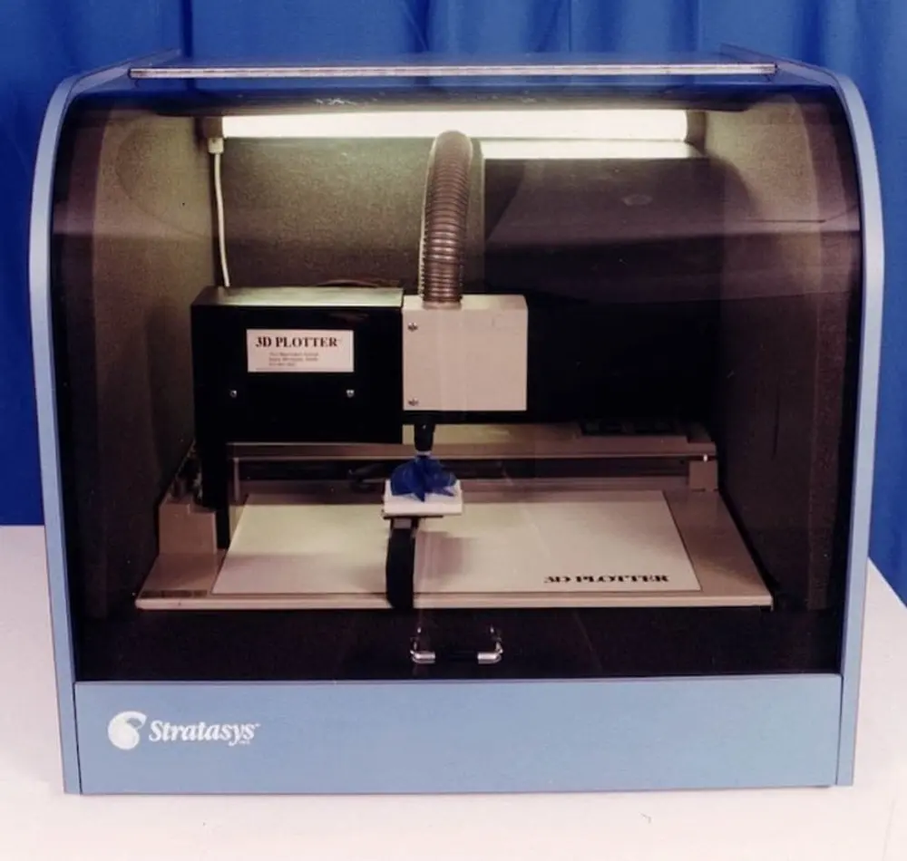

# Impresión 3D

<figure><figcaption></figcaption></figure>

La impresión 3D ha recorrido un largo camino desde su inicio, pero ¿cuándo fue eso? Si, como la mayoría de la gente, piensas en la impresión 3D como una nueva tecnología, te llevarás una sorpresa. Si bien es cierto que la industria ha dado grandes saltos adelante en los últimos años, todo se está construyendo sobre una base que se remonta a casi un siglo.

Desde esos primeros días, la impresión 3D ha llegado a referirse a una variedad de tecnologías específicas, algunas de las más comunes son el [modelado por deposición fundida (FDM),](https://all3dp.com/2/fused-deposition-modeling-fdm-3d-printing-simply-explained/) la [estereolitografía (SLA)](https://all3dp.com/1/sla-3d-printing-guide/) y [la sinterización selectiva por láser (SLS).](https://all3dp.com/2/sla-vs-sls-3d-printing-technology-shootout/) Los primeros picos de la impresión 3D llegaron cuando cada una de estas tecnologías fue desarrollada, patentada y registrada.

El siguiente salto adelante se produjo cuando estas patentes comenzaron a expirar y más personas pudieron experimentar con la tecnología. Es este período de tiempo, cuando la impresión FDM explotó en popularidad, que muchas personas piensan erróneamente como los orígenes de la impresión 3D.

Pero, ¿qué tecnología fue primero y cuándo? Aquí está nuestra guía sobre la historia de cuando se inventó la impresión 3D.

<figure><figcaption></figcaption></figure>

La idea de la impresión 3D se remonta a 1945, cuando el escritor de ciencia ficción Murray Leinster describió por primera vez la tecnología con sorprendente precisión en su cuento "Things Pass By". Imaginó una máquina que podría tomar sus dibujos y replicarlos con un brazo móvil, utilizando plástico derretido para formar objetos 3D. Ahora alguien solo necesitaba hacer realidad su idea.

## Artur C. Clarke - Replicador:



Artur C.Clarke plantea la idea de una máquina que puede replicar casi cualquier cosa, sin realmente definir cómo la haría.

Luego podemos ver esta máquina cobrar vida en Star Trek y más adelante en los Supersónicos.

<figure><figcaption></figcaption></figure>

## 1984-1988: La invención de la estereolitografía

<figure><figcaption></figcaption></figure>

Aquí es donde entra Charles "Chuck" Hull, el padre de la impresión 3D. En 1984 presentó una patente para un sistema de estereolitografía, solo tres semanas después de que el trío en Francia solicitara la suya. La idea de Hull era utilizar las lámparas UV de su empresa para curar resina fotosensible capa por capa para crear pequeñas piezas personalizadas.

Su patente fue aprobada en 1986 y comenzó su propia empresa: 3D Systems. Dos años más tarde lanzaron la primera impresora 3D disponible comercialmente, la SLA-1, en 1988. Más allá de la espectacular máquina en sí, Hull también desarrolló el formato de archivo STL y el proceso de corte digital que siguen siendo cruciales para la industria de la impresión 3D hasta el día de hoy.

## 1988-1993: Los otros métodos

<figure><figcaption></figcaption></figure>

A estas alturas ya se ha dado cuenta de que la impresión SLA fue la primera en llegar al mercado, pero la impresión FDM y SLS no se quedaron atrás. Ambos tuvieron sus primeras patentes aprobadas presentadas en 1988.

La sinterización selectiva por láser fue inventada por primera vez en Texas por el estudiante universitario Carl Deckard. Solo un estudiante universitario en ese momento, su impresora era rudimentaria y solo podía producir piezas básicas de plástico. Aún así, la idea estaba allí y la ejecución pronto se convirtió en la impresión SLS que conocemos hoy.

También se presentó en 1988 la patente de una máquina de modelado de deposición fundida por Scott Crump, cofundador de [Stratasys](https://www.stratasys.com/). Hubo que esperar hasta 1992 para que se concediera la patente, pero Stratasys se apresuró a tomar la delantera en la impresión 3D con sus nuevas máquinas FDM.

Este período termina con lo que puede causar cierta confusión sobre cuánto tiempo ha existido la impresión 3D. En 1993, el profesor del MIT Emanuel Sachs introdujo el término "impresión 3D" en el léxico, y la industria anteriormente conocida como "prototipado rápido" nunca miró hacia atrás.








