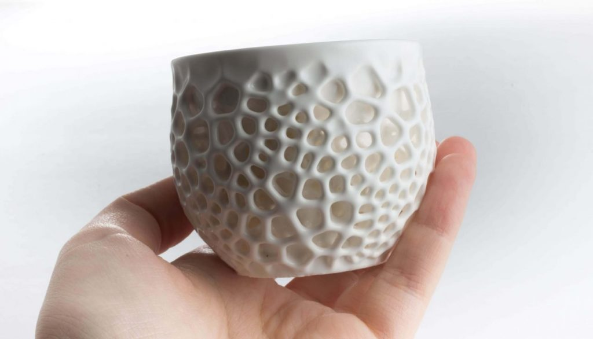

# Resinas · Fotopolímeros

<figure><figcaption></figcaption></figure>

El siguiente material en esta guía de materiales de impresión 3D, son los **fotopolímeros**. Son una gama de resinas líquidas que se solidifican en objetos y prototipos de plástico cuando se exponen a la luz ultravioleta (UV) o la luz visible. Las dos tecnologías principales actuales son SLA ([**estereolitografía**](https://formizable.com/como-funciona-la-estereolitografia/)) y **PolyJet**. El SLA trabaja utilizando un láser UV, de luz ultravioleta, que traza la forma de un objeto sobre la superficie de un contenedor de fotopolímero líquido. Entonces la resina se solidifica para formar una capa del objeto. Esta operación se repite para cada capa hasta que el objeto se completa.

El método **PolyJet**, por otro lado, sigue otro sistema: El cabezal de una impresora inyecta una gota de resina en un contenedor que se endurece instantáneamente con una lámpara de rayos UV conectada. Las impresoras SLA ofrecen una altura de capa de aproximadamente 0,1mm en el mejor de los casos, mientras que **PolyJet** puede imprimir en 3D hasta 16 micras (0,016mm). Aunque ambos métodos son similares y utilizan materiales de impresión 3D esencialmente similares, difieren ampliamente en la forma en que estos materiales de impresión se pueden explotar. Todos los fotopolímeros son sensibles a la luz solar.
